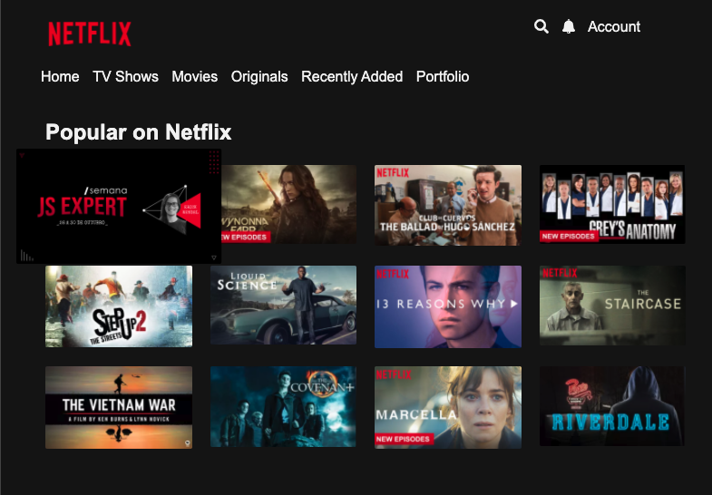

# Projeto da JS Expert Week 01

- Acesse o [index](./public/index/index.html) para visualizar a lista de titulos
- Acesse o [bandersnatch](./public/bandersnatch/index.html) para acessar o titulo base do projeto

## Lista de Títulos



## Vídeo


## Comandos

### Exibir codecs de audio e video

```bash
docker-compose exec bandersnatch MP4Box -info assets/timeline/01.intro-1920x1080.mp4
```

### Iniciar a cnd de imagens

```bash
docker-compose exec bandersnatch yarn assets
```

### Iniciar a api web de processamento de imagens

```bash
docker-compose exec bandersnatch yarn dev
```

## Problemas possiveis

Caso tenha problemas ao executar o scipt, rode os comandos abaixo

```bash
docker-compose exec bandersnatch ash
chmod g+rx,o+rx script.sh
```

ou

```bash
sudo chmod 777 script.sh
```

### Créditos

- Layout da lista foi baseada no  codepen do [Carlos Avila](https://codepen.io/cb2307/pen/XYxyeY)
- Layout do video foi baseado no codepen do [Benjamin Pott](https://codepen.io/benjipott/pen/JELELN)
